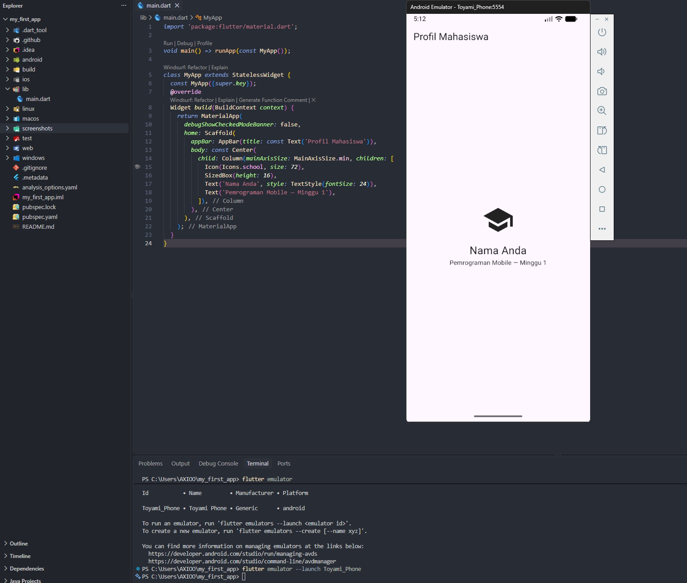
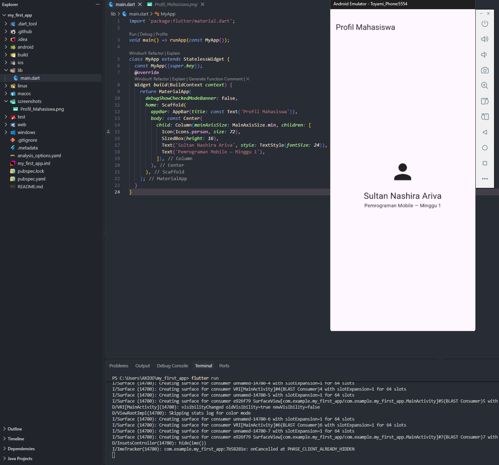
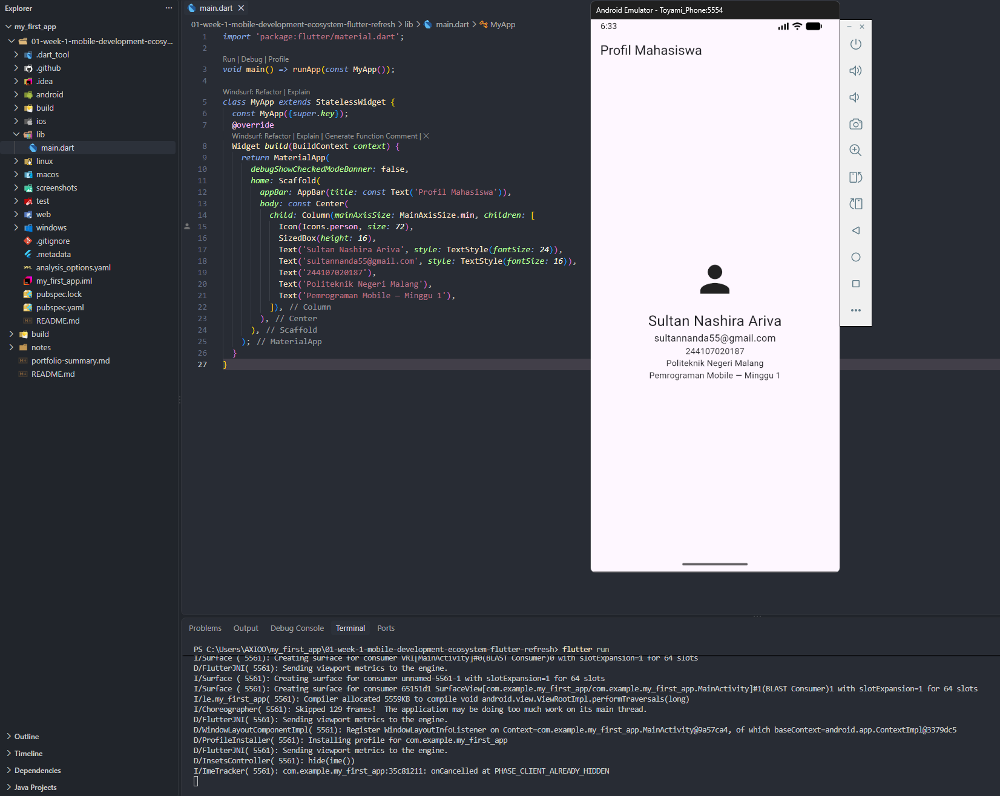

# Laporan Tugas Minggu 01 | Mobile Development Ecosystem & Flutter Refresh

- **Nama Mahasiswa**: Sultan Nashira Ariva
- **NIM**: 244107020187
- **Tautan Repositori**: [244107020187-mobile-course](https://github.com/sultanariva/244107020187-mobile-course)
- **Status**: ✅

---

## 1. Tujuan

Mempersiapkan ekosistem pengembangan Flutter SDK, memahami eksekusi perintah dasar CLI, mengonfigurasi emulator Android Small_phone, serta memahami alur kerja Hot Reload dan Hot Restart.

---

## 2. Langkah Praktikum

### 1. Membuat dan menjalankan proyek

Buka terminal pada folder kerja, lalu jalankan:

```
flutter create my_first_app
cd my_first_app
flutter run
```

Pilih emulator atau perangkat fisik bila diminta. Setelah aplikasi contoh tampil, tekan r di terminal untuk hot reload atau R untuk hot restart.


### 2. Mengubah UI default

Buka lib/main.dart, ganti isinya dengan kode berikut, simpan, dan amati hot reload.

```bash
import 'package:flutter/material.dart';

void main() => runApp(const MyApp());

class MyApp extends StatelessWidget {
  const MyApp({super.key});
  @override
  Widget build(BuildContext context) {
    return MaterialApp(
      debugShowCheckedModeBanner: false,
      home: Scaffold(
        appBar: AppBar(title: const Text('Profil Mahasiswa')),
        body: const Center(
          child: Column(mainAxisSize: MainAxisSize.min, children: [
            Icon(Icons.school, size: 72),
            SizedBox(height: 16),
            Text('Nama Anda', style: TextStyle(fontSize: 24)),
            Text('Pemrograman Mobile — Minggu 1'),
          ]),
        ),
      ),
    );
  }
}
```




### 3. Mengubah Nama dan Icon

Ganti Nama Anda dengan nama sendiri. Ubah ikon atau teks sekali, lalu bandingkan hasil hot reload dan hot restart.



### 4. Menambahkan NIM & Informasi tambahan 

Menambahkan NIM, dan informasi tambahan dengan menggunakan komponen dengan kode sebagai berikut setelah Text untuk menambahkan nama:



---

## 3. Refleksi

### 1. Kapan pengembangan Native lebih tepat dipilih daripada Cross-Platform?
Pengembangan Native lebih sesuai untuk aplikasi yang membutuhkan performa maksimal, seperti game dengan grafis kompleks, atau membutuhkan akses mendalam ke fitur perangkat tertentu. Sementara itu, Flutter menjadi pilihan yang efisien untuk aplikasi yang ingin dikembangkan pada beberapa platform sekaligus karena satu basis kode dapat digunakan bersama.

### 2. Bagaimana perubahan State berhubungan dengan Widget Tree dan UI Deklaratif?
State menyimpan data yang memengaruhi tampilan aplikasi. Ketika state berubah, Flutter membangun kembali bagian widget tree yang terdampak sehingga UI ikut menyesuaikan secara otomatis. Pendekatan ini membuat pengembangan tampilan lebih teratur karena UI didefinisikan berdasarkan kondisi data saat itu.

### 3. Mengapa commit kecil dengan pesan jelas bermanfaat bagi tim dan portofolio?
Commit yang dibuat secara bertahap dengan pesan yang informatif membuat setiap perubahan lebih mudah dipahami dan dilacak. Cara ini juga membantu proses pencarian sumber masalah ketika terjadi error serta memberikan gambaran bahwa pengembangan dilakukan secara rapi dan terorganisir.

---

## 4. Kesimpulan

Praktikum Minggu 01 memberikan pemahaman dasar tentang persiapan lingkungan Flutter, penggunaan Android Emulator, dan pembuatan aplikasi Profil Mahasiswa. Selain berhasil menjalankan aplikasi, praktikum ini juga membantu memahami perbedaan Hot Reload dan Hot Restart serta cara mengatasi kendala lisensi SDK melalui penyesuaian versi `cmdline-tools`.