# Laporan Tugas Minggu 02 | Declarative UI & Responsive Design

- **Nama Mahasiswa**: Sultan Nashira Ariva
- **NIM**: 244107020187
- **Tautan Repositori**: [244107020187-mobile-course](https://github.com/sultanariva/244107020187-mobile-course)
- **Status**: ✅

---

## 1. Tujuan

Membuat dashboard akademik berbasis Flutter yang responsif, dengan header profil, empat kartu informasi, tata letak satu kolom pada layar sempit dan dua kolom pada layar lebar, serta penerapan toggle tema dan label aksesibilitas agar tampilan lebih nyaman digunakan.

---

## 2. Langkah Praktikum: layout sederhana (warm-up)

### 2.1. Persiapan

Sebelum dashboard responsif, latih dulu widget dasar dengan membuat kartu profil sederhana. Buat project baru atau ganti sementara isi lib/main.dart:

```bash
import 'package:flutter/material.dart';

void main() => runApp(const ProfileApp());

class ProfileApp extends StatelessWidget {
  const ProfileApp({super.key});

  @override
  Widget build(BuildContext context) {
    return const MaterialApp(
      debugShowCheckedModeBanner: false,
      home: Scaffold(
        body: Center(child: ProfileCard()),
      ),
    );
  }
}

class ProfileCard extends StatelessWidget {
  const ProfileCard({super.key});

  @override
  Widget build(BuildContext context) {
    return Container(
      width: 320,
      padding: const EdgeInsets.all(16),
      decoration: BoxDecoration(
        color: Colors.indigo.shade50,
        borderRadius: BorderRadius.circular(16),
      ),
      child: Column(
        mainAxisSize: MainAxisSize.min,
        children: [
          Row(
            children: [
              const CircleAvatar(child: Icon(Icons.person)),
              const SizedBox(width: 12),
              Expanded(
                child: Column(
                  crossAxisAlignment: CrossAxisAlignment.start,
                  children: const [
                    Text('Nama Mahasiswa',
                        style: TextStyle(fontWeight: FontWeight.bold)),
                    Text('...ketik nama Anda di sini...'),
                  ],
                ),
              ),
            ],
          ),
          const SizedBox(height: 12),
          const Row(children: [
            Expanded(child: Text('NIM')),
            Text('...ketik NIM Anda di sini...'),
          ]),
          const Row(children: [
            Expanded(child: Text('Kelas')),
            Text('...ketik kelas Anda di sini...'),
          ]),
        ],
      ),
    );
  }
}
```


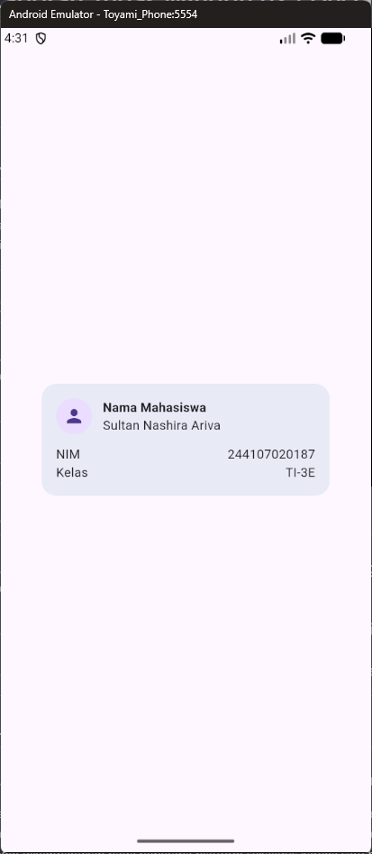

### 2.2. Hapus Expanded pada baris nama, lalu amati peringatan overflow atau perilaku layout-nya; kembalikan setelah itu.

Ketika Amenghapus widget Expanded, peringatan overflow muncul karena widget anak di dalam Row atau Column mencoba mengambil ruang yang melebihi kapasitas layar atau wilayah induknya.

### 2.3. Ganti mainAxisSize: MainAxisSize.min menjadi nilai default dan amati perubahan tinggi kartu.

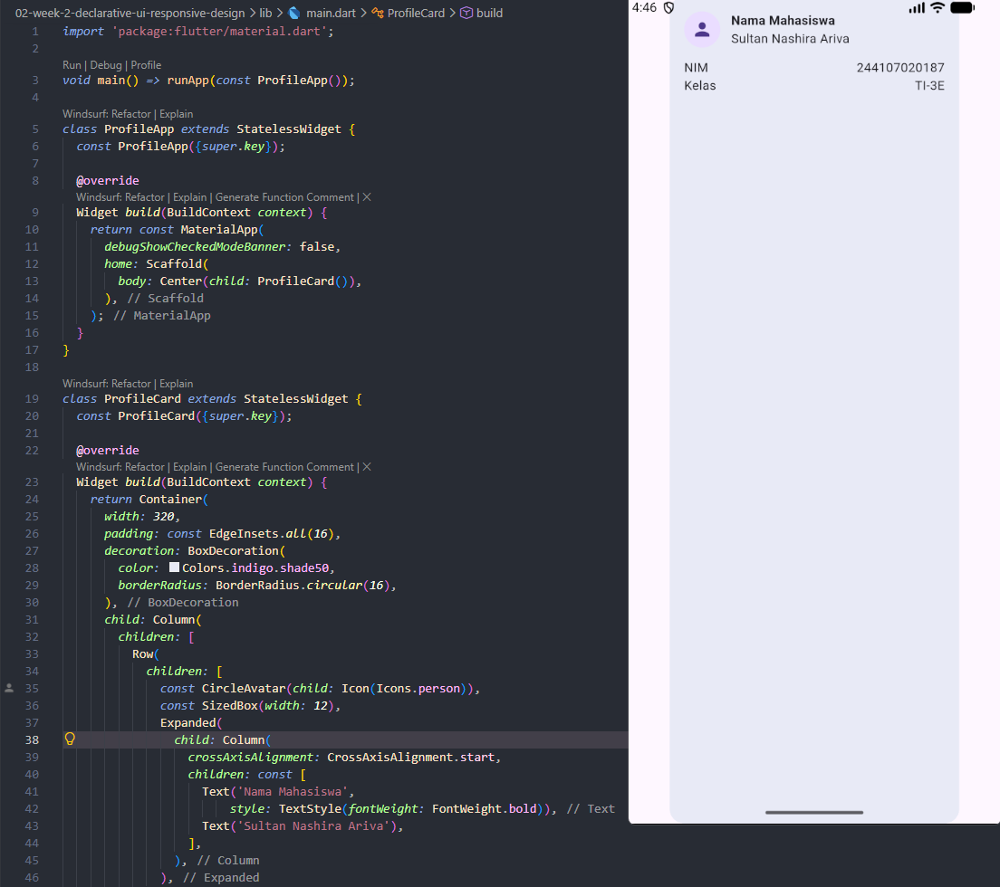

MainAxisSize.min membuat Column hanya sebesar kebutuhan minimal anaknya.
Kalau dihapus, Column memakai ukuran default yang lebih fleksibel sesuai ruang yang tersedia dan isi kontennya.


### 2.4. Tambahkan satu baris data (misal Email) menggunakan pola Row + Expanded yang sama.

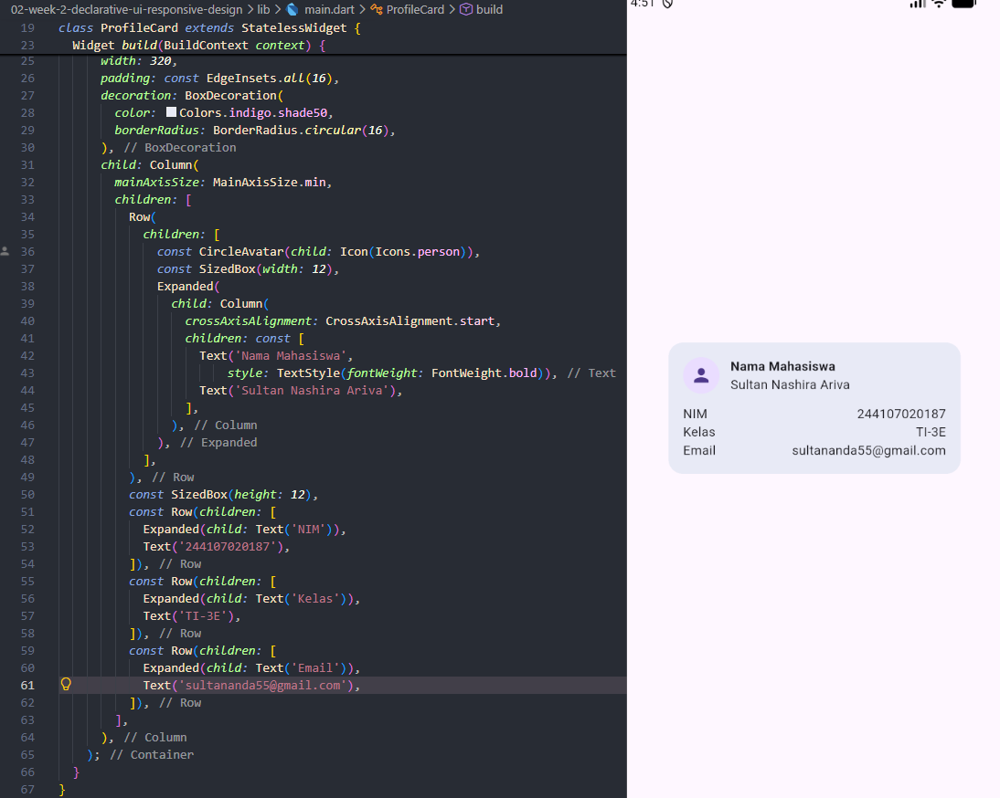

---

## 3. Langkah Praktikum: dashboard responsif

### 3.1. Menyiapkan project

Jalankan di terminal:
```bash
flutter create responsive_dashboard
cd responsive_dashboard
flutter run
```

Buka lib/main.dart. Buat aplikasi profil sederhana berikut, lalu jalankan pada emulator atau perangkat fisik.

```bash
import 'package:flutter/material.dart';

void main() => runApp(const DashboardApp());

class DashboardApp extends StatelessWidget {
  const DashboardApp({super.key});

  @override
  Widget build(BuildContext context) {
    return MaterialApp(
      debugShowCheckedModeBanner: false,
      theme: ThemeData(useMaterial3: true, colorSchemeSeed: Colors.indigo),
      darkTheme: ThemeData(useMaterial3: true, brightness: Brightness.dark, colorSchemeSeed: Colors.indigo),
      themeMode: ThemeMode.system,
      home: const DashboardPage(),
    );
  }
}

class DashboardPage extends StatelessWidget {
  const DashboardPage({super.key});

  @override
  Widget build(BuildContext context) {
    return Scaffold(
      appBar: AppBar(title: const Text('Student Dashboard')),
      body: LayoutBuilder(
        builder: (context, constraints) {
          final columns = constraints.maxWidth >= 700 ? 2 : 1;
          return GridView.count(
            padding: const EdgeInsets.all(16),
            crossAxisCount: columns,
            crossAxisSpacing: 16,
            mainAxisSpacing: 16,
            childAspectRatio: 2.6,
            children: const [
              DashboardCard(title: 'Assignments', value: '8'),
              DashboardCard(title: 'Attendance', value: '92%'),
              DashboardCard(title: 'Portfolio', value: 'Ready'),
              DashboardCard(title: 'Current week', value: '02'),
            ],
          );
        },
      ),
    );
  }
}

class DashboardCard extends StatelessWidget {
  const DashboardCard({required this.title, required this.value, super.key});
  final String title;
  final String value;

  @override
  Widget build(BuildContext context) {
    return Card(
      child: Padding(
        padding: const EdgeInsets.all(20),
        child: Row(children: [
          Expanded(child: Text(title)),
          Text(value, style: Theme.of(context).textTheme.headlineSmall),
        ]),
      ),
    );
  }
}
```

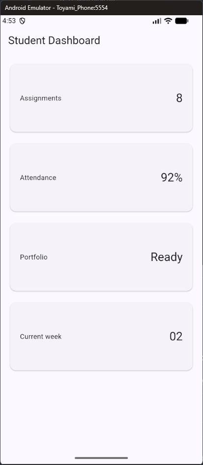

### 3.2. Menambahkan interaksi: StatefulWidget dan Cupertino

Sejauh ini dashboard masih StatelessWidget. Ubah DashboardApp menjadi StatefulWidget dan tambahkan CupertinoSwitch (widget Cupertino) pada AppBar untuk mengganti tema secara manual — sekaligus membedakan komponen Material dan Cupertino secara langsung:

```bash
class DashboardApp extends StatefulWidget {
  const DashboardApp({super.key});

  @override
  State<DashboardApp> createState() => _DashboardAppState();
}

class _DashboardAppState extends State<DashboardApp> {
  bool isDark = false;

  @override
  Widget build(BuildContext context) {
    return MaterialApp(
      debugShowCheckedModeBanner: false,
      theme: ThemeData(useMaterial3: true, colorSchemeSeed: Colors.indigo),
      darkTheme: ThemeData(useMaterial3: true, brightness: Brightness.dark, colorSchemeSeed: Colors.indigo),
      themeMode: isDark ? ThemeMode.dark : ThemeMode.light,
      home: DashboardPage(
        isDark: isDark,
        onDarkChanged: (value) => setState(() => isDark = value),
      ),
    );
  }
}
```

Sesuaikan DashboardPage agar menerima state dan callback:

```bash
class DashboardPage extends StatelessWidget {
  const DashboardPage({
    required this.isDark,
    required this.onDarkChanged,
    super.key,
  });
  final bool isDark;
  final ValueChanged<bool> onDarkChanged;

  @override
  Widget build(BuildContext context) {
    return Scaffold(
      appBar: AppBar(
        title: const Text('Student Dashboard'),
        actions: [
          Row(
            children: [
              Icon(isDark ? Icons.dark_mode : Icons.light_mode),
              const SizedBox(width: 4),
              CupertinoSwitch(
                value: isDark,
                onChanged: onDarkChanged,
              ),
              const SizedBox(width: 12),
            ],
          ),
        ],
      ),
      body: LayoutBuilder(
        // ... kode GridView sebelumnya, tidak berubah
      ),
    );
  }
}
```

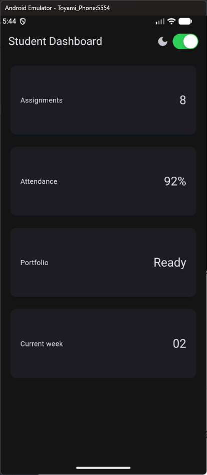

### 3.3. Ubah breakpoint dari 700 menjadi nilai lain dan amati perubahan jumlah kolom.

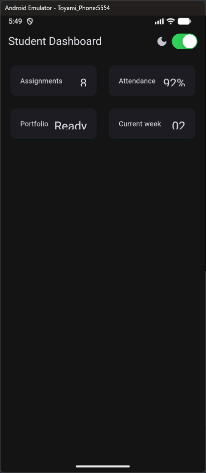

Saat breakpoint lebih kecil, layout akan beralih ke 2 kolom pada layar yang lebih sempit.
Artinya, threshold responsif berubah dan UI menjadi lebih cepat “beradaptasi” ke layout 2 kolom.

### 3.4. Uji aplikasi dengan ukuran layar emulator yang berbeda.

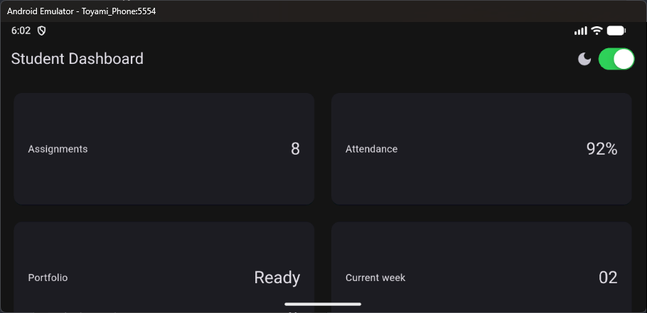

---

## 4. Tugas Utama

Kembangkan dashboard menjadi halaman Academic Overview

- Tampilan sempit (potrait)

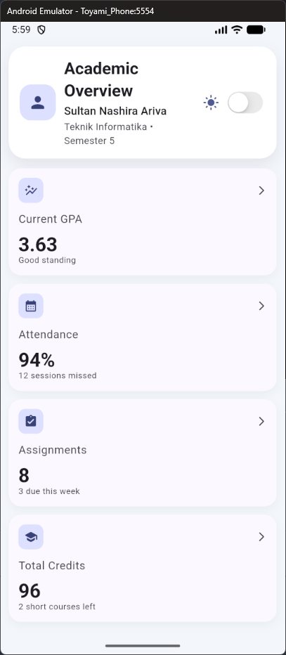

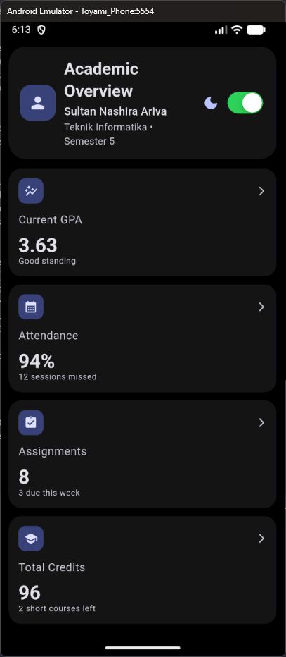

- Tampilan lebar (landscape)

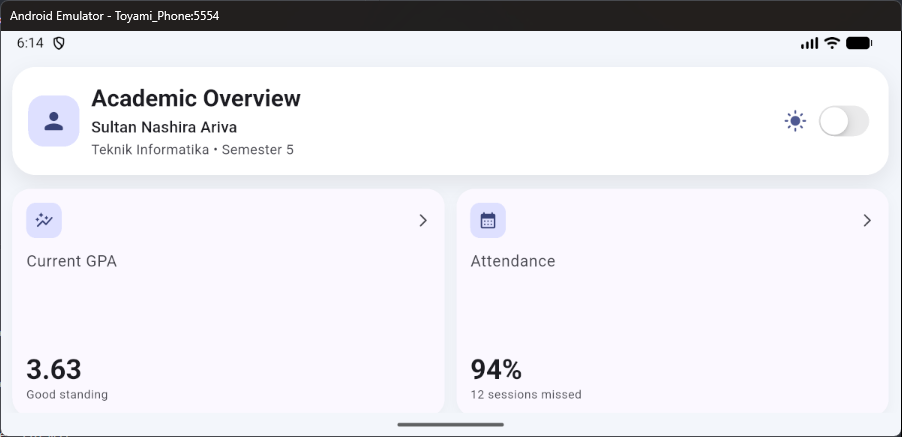

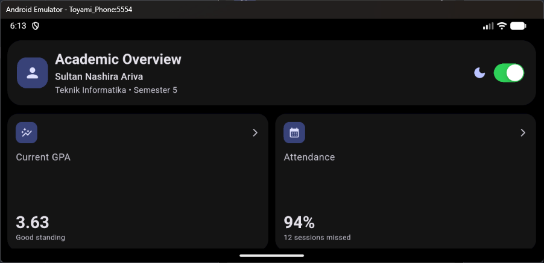

---

## 5. AI Prompt Challenge

Setelah implementasi mandiri selesai, gunakan AI hanya untuk membandingkan dua alternatif tata letak.

### 5.1. Prompt desain

> "Bandingkan dua tata letak dashboard akademik untuk Flutter: versi `GridView` dan versi `LayoutBuilder` + `Column`. Jelaskan trade-off responsif dan aksesibilitasnya."

### 5.2. Prompt penguatan konsep

> "Jelaskan kapan penggunaan `Expanded` justru menyebabkan overflow di dalam `Row`, beri contoh kode yang gagal dan perbaikannya."

### 5.3. Verification prompt

> "Periksa kembali rekomendasi layout di atas: apakah tetap responsif di bawah 600px, apakah mengurangi aksesibilitas, dan apakah ada widget yang tidak tersedia di Flutter stabil saat ini?"

### 5.4. Output penting dari AI

Setelah dilakukan evaluasi, dipilih pendekatan yang paling sesuai untuk dashboard Academic Overview:

- `GridView` cocok untuk kumpulan kartu yang seragam dan cepat dibuat.
- `LayoutBuilder` + `Column` lebih fleksibel untuk header profil, spacing custom, dan kartu dengan tinggi konten yang berbeda.
- Pada layar sempit, layout yang dipilih tetap mengubah jumlah kolom menjadi 1, sehingga tetap responsif.
- Aksesibilitas tetap terjaga karena penggunaan `Semantics`, label yang jelas, dan ukuran ruang yang cukup untuk teks serta tombol.
- `CupertinoSwitch`, `Semantics`, `LayoutBuilder`, dan `GridView` tersedia di Flutter stabil dan aman digunakan.

### 5.5. Keputusan yang dipilih

Dashboard final dibuat dengan pendekatan yang menggabungkan responsivitas dan kontrol visual:

- `LayoutBuilder` digunakan untuk menentukan breakpoint dan memodifikasi layout secara dinamis.
- `GridView.count` dipakai untuk kartu informasi agar susunannya rapi saat layar lebar.
- `Semantics` ditambahkan pada area penting untuk aksesibilitas.
- `CupertinoSwitch` dipakai untuk menukar mode terang/gelap secara interaktif.

Keputusan ini dipilih karena dashboard memiliki karakteristik unik: header profil, teks panjang, dan empat kartu dengan kebutuhan visual yang berbeda. Pendekatan ini lebih mudah dikustomisasi daripada menerapkan `GridView` secara kaku untuk seluruh halaman.

### 5.6. Alasan teknis

1. `GridView` sangat kuat untuk list item yang seragam, tetapi kurang cocok jika terdapat elemen yang lebih kompleks seperti header + info profil + status + card dengan proporsi visual tertentu.
2. `LayoutBuilder` memungkinkan penyesuaian berdasarkan lebar layar tanpa mengorbankan struktur tata letak yang terlihat lebih natural untuk desain mobile.
3. `Expanded` hanya aman jika ruang dalam parent terbatas dan semua child memiliki ukuran yang jelas. Jika `Expanded` dipaksa di dalam `Row` tanpa ruang yang cukup, maka hasilnya bisa overflow atau child memaksa satu baris menjadi terlalu besar.
4. Desain yang dipilih tetap responsif di bawah 600px karena breakpoint diberi toleransi yang masuk akal dan layout card beralih ke satu kolom.

### 5.7. Contoh konsep overflow `Expanded`

Contoh kode yang gagal:

```dart
Row(
  children: [
    Icon(Icons.person),
    Expanded(
      child: Text('Nama Mahasiswa yang sangat panjang'),
    ),
  ],
)
```

Pada kondisi ruang sempit, `Expanded` akan memaksa teks mengambil sisa ruang, dan jika parent terlalu kecil atau kontennya terlalu panjang, maka akan muncul overflow.

Perbaikannya:

```dart
Row(
  children: [
    Icon(Icons.person),
    SizedBox(width: 12),
    Expanded(
      child: Text(
        'Nama Mahasiswa yang sangat panjang',
        overflow: TextOverflow.ellipsis,
      ),
    ),
  ],
)
```

Atau dengan mengubah layout menjadi `Column` jika teks memerlukan ruang vertical yang lebih banyak.

### 5.8. Bukti verifikasi

Bukti verifikasi dilakukan dengan meninjau perilaku layar pada emulator dan membandingkan tampilan:

- Potrait light: layar sempit tetap tampil rapi dengan satu kolom.
- Potrait dark: tema gelap tetap nyaman dibaca dan tidak menurunkan aksesibilitas.
- Landscape light: dua kolom terbentuk dengan proporsi yang seimbang.
- Landscape dark: layout tetap stabil dan tidak ada widget yang tidak tersedia di Flutter stabil.

Referensi visual yang dipakai untuk verifikasi:

- `screenshots/potrait_light.png`
- `screenshots/potrait_dark.png`
- `screenshots/landscape_light.png`
- `screenshots/landscape_dark.png`

Kesimpulan verifikasi:

- Responsif di bawah 600px: ✅
- Aksesibilitas tetap terjaga: ✅
- Widget yang tidak stabil: ❌ tidak ditemukan pada Flutter stable untuk kebutuhan ini

---

## 6. Refleksi

### 6.1. Apa perbedaan cara berpikir imperative dan declarative saat membangun UI? 
Imperative vs declarative: pendekatan imperative menitikberatkan langkah-langkah manual dalam membangun UI, sedangkan declarative fokus pada hasil berdasarkan state dan kondisi layar. Dalam Flutter, declarative lebih cocok karena UI akan dibangun ulang saat data atau ukuran berubah.

### 6.2. Kapan `Expanded` membantu dan kapan penggunaannya justru menghasilkan layout error?
`Expanded` membantu saat kita ingin child mengisi ruang sisa dalam `Row` atau `Column`, tetapi dapat menimbulkan overflow ketika parent terlalu sempit atau child terlalu panjang. Solusinya bisa menggunakan 
`Flexible`, membatasi teks dengan `overflow`, atau mengubah layout saat breakpoint tertentu.

### 6.3. Bagaimana breakpoint dan theme memengaruhi pengalaman pengguna?
Breakpoint dan tema sangat memengaruhi pengalaman pengguna. Breakpoint mengatur kapan layout berubah dari satu kolom ke dua kolom, sedangkan tema memengaruhi kenyamanan baca, kontras, dan mood tampilan. Mode gelap dan terang sama-sama penting tergantung kondisi penggunaan.

### 6.4. Apa yang Anda verifikasi dari rekomendasi AI setelah tugas inti selesai?
Verifikasi AI dilakukan setelah tugas inti selesai: layout tetap responsif di bawah 600px, aksesibilitas tetap terjaga, dan tidak ada widget yang tidak stabil pada Flutter stable. Hasilnya, rekomendasi kombinasi `LayoutBuilder` + `GridView` terbukti tepat untuk dashboard Academic Overview.

---

## 7. Kesimpulan

Pada tugas minggu ini, saya belajar bahwa Flutter cocok dibangun dengan pola declarative karena UI dapat menyesuaikan diri secara otomatis terhadap state, ukuran layar, dan tema. Kombinasi `LayoutBuilder` dan `GridView` berhasil menghasilkan dashboard akademik yang responsif, rapi, dan mudah diakses.

`Expanded` adalah alat yang sangat berguna, tetapi harus digunakan dengan hati-hati agar tidak menyebabkan overflow. Breakpoint dan tema memiliki peran penting dalam menyesuaikan pengalaman pengguna pada berbagai ukuran layar dan kondisi visual. Setelah verifikasi, rekomendasi AI yang dipilih terbukti konsisten dengan kebutuhan tugas: tetap responsif, tetap ramah aksesibilitas, dan aman digunakan pada Flutter stable.
