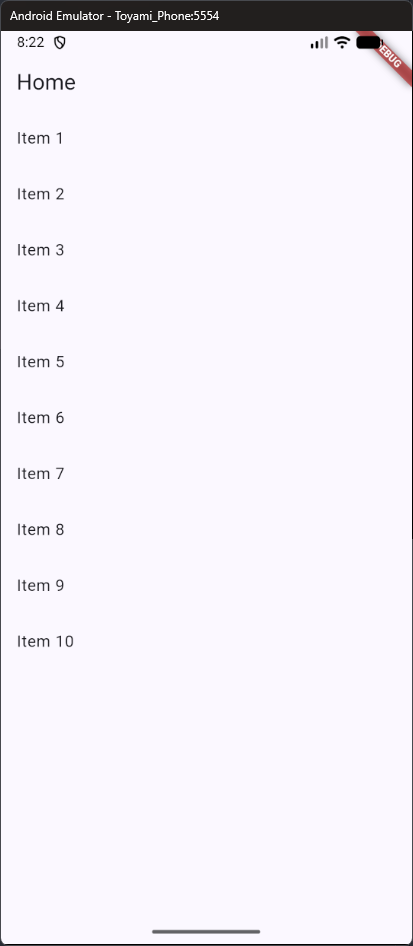
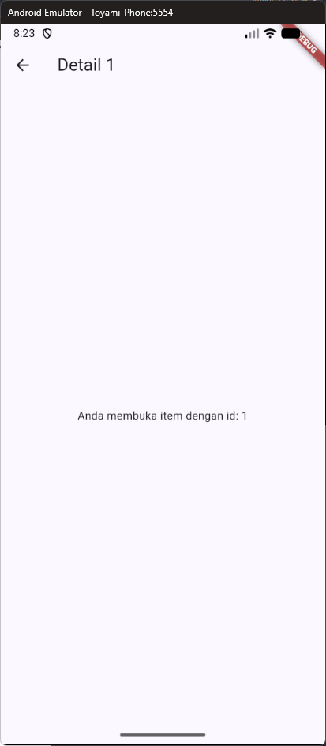
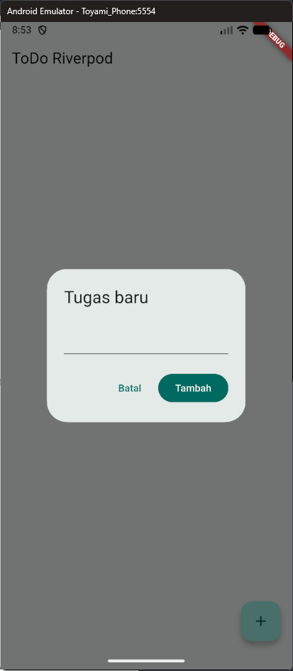
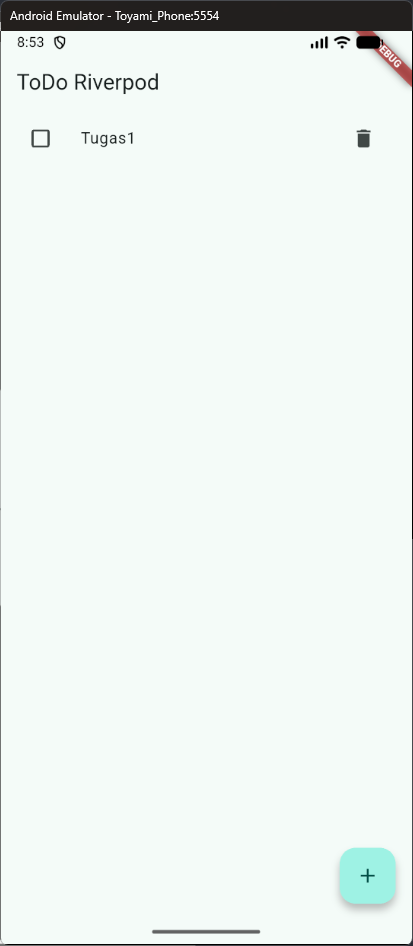
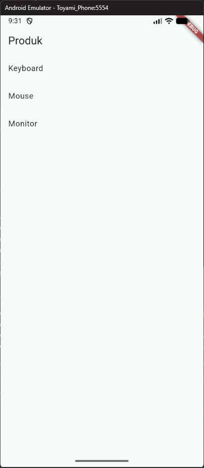
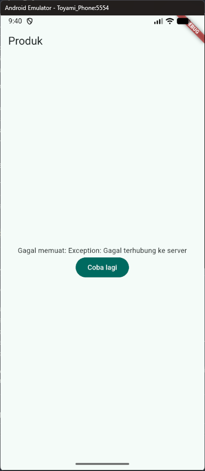
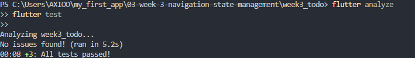

# Laporan Tugas Minggu 03 | Navigation & State Management

- **Nama Mahasiswa**: Sultan Nashira Ariva
- **NIM**: 244107020187
- **Tautan Repositori**: [244107020187-mobile-course](https://github.com/sultanariva/244107020187-mobile-course)
- **Status**: ✅

---

## 1. Tujuan

Mempelajari konsep navigasi pada Flutter, memahami cara kerja route dan stack pada Navigator, serta mengenal GoRouter sebagai solusi navigasi yang lebih terstruktur. Selain itu, pada materi ini juga diperkenalkan dasar state management menggunakan Riverpod dan AsyncValue untuk menangani state loading, error, dan success secara lebih rapi pada aplikasi yang kompleks.

---

## 2. Praktikum 1 — Aplikasi multi-page dengan GoRouter

### 2.1. Persiapan project

Jalankan perintah berikut:

```bash
flutter create week3_navigation
cd week3_navigation
flutter pub add go_router
```

Setelah itu, buat struktur folder seperti berikut:

```text
lib/
├── main.dart
└── pages/
    ├── home_page.dart
    └── detail_page.dart
```

### 2.2. Konfigurasi router di main.dart

```dart
import 'package:flutter/material.dart';
import 'package:go_router/go_router.dart';
import 'pages/detail_page.dart';
import 'pages/home_page.dart';

void main() => runApp(const MyApp());

final _router = GoRouter(
  initialLocation: '/',
  routes: [
    GoRoute(
      path: '/',
      builder: (context, state) => const HomePage(),
      routes: [
        GoRoute(
          path: 'detail/:id',
          builder: (context, state) => DetailPage(
            id: state.pathParameters['id']!,
          ),
        ),
      ],
    ),
  ],
);

class MyApp extends StatelessWidget {
  const MyApp({super.key});

  @override
  Widget build(BuildContext context) {
    return MaterialApp.router(
      title: 'Week 3 - Navigation',
      routerConfig: _router,
      theme: ThemeData(colorSchemeSeed: Colors.indigo, useMaterial3: true),
    );
  }
}
```

Catatan penting: untuk GoRouter, layout utama harus menggunakan `MaterialApp.router` dan bukan `MaterialApp` biasa.

### 2.3. Halaman Home

```dart
import 'package:flutter/material.dart';
import 'package:go_router/go_router.dart';

class HomePage extends StatelessWidget {
  const HomePage({super.key});

  @override
  Widget build(BuildContext context) {
    return Scaffold(
      appBar: AppBar(title: const Text('Home')),
      body: ListView.builder(
        itemCount: 10,
        itemBuilder: (context, index) => ListTile(
          title: Text('Item ${index + 1}'),
          onTap: () => context.go('/detail/${index + 1}'),
        ),
      ),
    );
  }
}
```

### 2.4. Halaman Detail

```dart
import 'package:flutter/material.dart';

class DetailPage extends StatelessWidget {
  final String id;

  const DetailPage({super.key, required this.id});

  @override
  Widget build(BuildContext context) {
    return Scaffold(
      appBar: AppBar(title: Text('Detail $id')),
      body: Center(
        child: Text('Anda membuka item dengan id: $id'),
      ),
    );
  }
}
```

### 2.5. Hasil yang diamati





Ketika aplikasi dijalankan:

- saat item diklik, aplikasi berpindah ke halaman detail,
- tombol back sistem dapat digunakan untuk kembali,
- path akan berubah sesuai halaman yang aktif,
- URL atau path dapat diakses secara langsung tanpa harus melalui Home,
- route dapat dibangun secara deklaratif dan lebih mudah dipelihara.

Ini menjadi bukti bahwa GoRouter lebih cocok untuk aplikasi dengan navigasi yang lebih kompleks dibanding Navigator 1.0.

---

## 3. Praktikum 2 — Aplikasi ToDo dengan Riverpod

### 3.1. Persiapan Project

Jalankan perintah berikut:

```bash
flutter create week3_todo
cd week3_todo
flutter pub add flutter_riverpod
```

### 3.2. Bungkus aplikasi dengan ProviderScope di lib/main.dart

```bash
import 'package:flutter/material.dart';
import 'package:flutter_riverpod/flutter_riverpod.dart';
import 'pages/todo_page.dart';

void main() => runApp(const ProviderScope(child: MyApp()));

class MyApp extends StatelessWidget {
  const MyApp({super.key});
  @override
  Widget build(BuildContext context) => MaterialApp(
        title: 'Week 3 - ToDo',
        theme: ThemeData(colorSchemeSeed: Colors.teal, useMaterial3: true),
        home: const TodoPage(),
      );
}
```

### 3.3. Buat state dan provider (lib/providers/todo_provider.dart)

```bash
import 'package:flutter_riverpod/flutter_riverpod.dart';

class Todo {
  Todo(this.title, {this.done = false});
  final String title;
  final bool done;

  Todo copyWith({String? title, bool? done}) =>
      Todo(title ?? this.title, done: done ?? this.done);
}

class TodoListNotifier extends Notifier<List<Todo>> {
  @override
  List<Todo> build() => const [];

  void add(String title) => state = [...state, Todo(title)];

  void toggle(int index) {
    final todos = [...state];
    todos[index] = todos[index].copyWith(done: !todos[index].done);
    state = todos;
  }

  void remove(int index) => state = [...state]..removeAt(index);
}

final todoListProvider =
    NotifierProvider<TodoListNotifier, List<Todo>>(TodoListNotifier.new);
```

### 3.4. Tampilkan dengan ConsumerWidget (lib/pages/todo_page.dart)

```bash
import 'package:flutter/material.dart';
import 'package:flutter_riverpod/flutter_riverpod.dart';
import '../providers/todo_provider.dart';

class TodoPage extends ConsumerWidget {
  const TodoPage({super.key});

  @override
  Widget build(BuildContext context, WidgetRef ref) {
    final todos = ref.watch(todoListProvider);

    return Scaffold(
      appBar: AppBar(title: const Text('ToDo Riverpod')),
      body: todos.isEmpty
          ? const Center(child: Text('Belum ada tugas'))
          : ListView.builder(
              itemCount: todos.length,
              itemBuilder: (context, index) => ListTile(
                leading: Checkbox(
                  value: todos[index].done,
                  onChanged: (_) =>
                      ref.read(todoListProvider.notifier).toggle(index),
                ),
                title: Text(
                  todos[index].title,
                  style: TextStyle(
                      decoration: todos[index].done
                          ? TextDecoration.lineThrough
                          : null),
                ),
                trailing: IconButton(
                  icon: const Icon(Icons.delete),
                  onPressed: () =>
                      ref.read(todoListProvider.notifier).remove(index),
                ),
              ),
            ),
      floatingActionButton: FloatingActionButton(
        onPressed: () => _showAddDialog(context, ref),
        child: const Icon(Icons.add),
      ),
    );
  }

  void _showAddDialog(BuildContext context, WidgetRef ref) {
    final controller = TextEditingController();
    showDialog(
      context: context,
      builder: (context) => AlertDialog(
        title: const Text('Tugas baru'),
        content: TextField(controller: controller, autofocus: true),
        actions: [
          TextButton(
            onPressed: () => Navigator.pop(context),
            child: const Text('Batal'),
          ),
          FilledButton(
            onPressed: () {
              if (controller.text.trim().isNotEmpty) {
                ref
                    .read(todoListProvider.notifier)
                    .add(controller.text.trim());
              }
              Navigator.pop(context);
            },
            child: const Text('Tambah'),
          ),
        ],
      ),
    );
  }
}
```

### 3.5. Hasil yang Diamati






Ketika aplikasi dijalankan, beberapa hal yang terlihat adalah:

- awalnya tampilan menampilkan teks "Belum ada tugas" karena daftar masih kosong,
- tombol `FloatingActionButton` berfungsi untuk menambahkan tugas baru melalui dialog,
- setelah tugas ditambahkan, daftar otomatis diperbarui tanpa perlu memanggil `setState()` secara manual,
- ketika checkbox ditekan, status tugas berubah menjadi selesai dan teks akan tercoret, menunjukkan state berhasil berubah secara reaktif,
- saat tombol hapus ditekan, item langsung hilang dari daftar sesuai dengan perubahan state yang terjadi,
- seluruh perubahan ini terjadi karena `ProviderScope` dan `ref.watch` memantau state dari provider secara real time.

Dengan demikian, praktikum ini membuktikan bahwa Riverpod membantu mengelola state aplikasi menjadi lebih sederhana, terstruktur, dan responsif terhadap interaksi pengguna.

---

## 4. Praktikum 3 — Uji ketiga state

Praktikum ini menguji tiga kondisi proses asynchronous, yaitu `loading` (proses berjalan), `error` (proses gagal), dan `success` (data berhasil dimuat). Riverpod menyediakan `AsyncValue<T>` untuk mewakili kondisi tersebut dalam satu tipe, sehingga UI tidak perlu mengelola beberapa flag boolean secara terpisah.

### 4.1. AsyncValue

Riverpod menyediakan AsyncValue<T> yang memodelkan ketiga kondisi tersebut dalam satu tipe. Gunakan AsyncNotifier untuk state asinkron:

```dart
class ProductsNotifier extends AsyncNotifier<List<String>> {
  @override
  Future<List<String>> build() async {
    await Future.delayed(const Duration(seconds: 2)); // simulasi network
    return ['Keyboard', 'Mouse', 'Monitor'];
  }

  Future<void> refresh() async {
    state = const AsyncLoading();
    state = await AsyncValue.guard(() => _fetch());
  }

  Future<List<String>> _fetch() async {
    await Future.delayed(const Duration(seconds: 1));
    return ['Keyboard', 'Mouse', 'Monitor', 'Headset'];
  }
}

final productsProvider =
    AsyncNotifierProvider<ProductsNotifier, List<String>>(
        ProductsNotifier.new);
```

Catatan: AsyncValue.guard otomatis menangkap exception dan mengubahnya menjadi AsyncError, hindari blok try/catch manual yang tersebar.

Di sisi UI, AsyncValue dapat dipola dengan when atau if-case matching:

```dart
class ProductPage extends ConsumerWidget {
  const ProductPage({super.key});

  @override
  Widget build(BuildContext context, WidgetRef ref) {
    final productsAsync = ref.watch(productsProvider);

    return Scaffold(
      appBar: AppBar(title: const Text('Produk')),
      body: productsAsync.when(
        loading: () => const Center(child: CircularProgressIndicator()),
        error: (err, stack) => Center(
          child: Column(
            mainAxisSize: MainAxisSize.min,
            children: [
              Text('Gagal memuat: $err'),
              FilledButton(
                onPressed: () => ref.invalidate(productsProvider),
                child: const Text('Coba lagi'),
              ),
            ],
          ),
        ),
        data: (products) => ListView.builder(
          itemCount: products.length,
          itemBuilder: (context, index) =>
              ListTile(title: Text(products[index])),
        ),
      ),
    );
  }
}
```

### 4.3. Langkah pengujian

1. Salin kode di atas ke project ToDo Anda (atau project terpisah) dan jalankan. Amati tampilan loading selama 2 detik pertama.



2. Ubah build() sementara untuk melempar error: throw Exception('Gagal terhubung ke server');. Jalankan dan amati UI error beserta tombol Coba lagi.



3. Tekan tombol Coba lagi, ref.invalidate membuat provider dijalankan ulang. Pulihkan kode, pastikan state success tampil.
4. Refleksikan: mengapa menampilkan data lama (*stale data*) bersama indikator refresh kadang lebih baik daripada mengosongkan layar? Kapan pola tersebut penting?

**Jawaban refleksi:** Menampilkan data lama selama proses refresh membuat layar tetap berguna dan menghindari tampilan kosong atau berkedip, terutama jika pemuatan ulang membutuhkan waktu atau gagal karena koneksi. Pengguna masih dapat melihat informasi terakhir sambil mengetahui bahwa data sedang diperbarui. Pola ini cocok untuk daftar produk, berita, atau dashboard ketika data lama masih dapat dijadikan acuan sementara. Namun, untuk informasi yang harus selalu akurat dan terbaru, seperti saldo atau status transaksi, aplikasi sebaiknya menandai data yang belum diperbarui dengan jelas atau menunggu hasil terbaru sebelum pengguna mengambil tindakan.

### 4.4. Hasil yang diamati

- Saat pemuatan berlangsung, UI menampilkan `CircularProgressIndicator`.
- Ketika pemuatan berhasil, UI menampilkan daftar produk.
- Ketika terjadi exception, UI menampilkan pesan error dan tombol **Coba lagi**.
- Tombol **Coba lagi** menjalankan ulang provider, kemudian UI kembali menampilkan loading dan hasil pemuatan terbaru.

Dengan `AsyncValue.when()`, tampilan dapat menyesuaikan diri terhadap state asynchronous secara terpusat dan lebih konsisten.

---

## 5. AI Prompt Challenge

Minta AI coding assistant (Cursor, Copilot, Claude Code, atau tool setara) dengan prompt berikut:

```bash
Buatkan halaman Flutter bernama StatsPage menggunakan flutter_riverpod.
Requirements:
- ConsumerWidget dengan satu AsyncNotifierProvider yang mensimulasikan
  pengambilan data statistik (delay 2 detik, kadang gagal 30%).
- UI harus menangani loading (spinner), error (pesan + tombol retry),
  dan success (ListView 3 item).
- Berikan unit test untuk notifier-nya.
Jelaskan setiap bagian kode dalam komentar.
```

### AI Verification Checklist

- [✅] State diubah secara immutable: tidak ada `state.add()` atau mutasi list langsung; semua update dibuat dengan salinan list baru `[...]`.
- [✅] `ref.watch` hanya dipakai di dalam `build`, sedangkan `ref.read` dipakai di callback/aksi UI seperti tombol retry dan aksi update.
- [✅] Ketiga state `AsyncValue` ditangani: `loading`, `error`, dan `data`.
- [✅] Provider dideklarasikan dengan tipe eksplisit dan tidak duplikat dengan provider lain.
- [✅] Kode memakai pola modern Riverpod: `AsyncNotifier` + `ConsumerWidget`, tanpa `StateProvider`, `StateNotifierProvider`, atau nested `Consumer` yang tidak perlu.

### Bukti validasi

Command yang dijalankan:

```bash
flutter analyze
flutter test
```

Hasil validasi:




---

## 6. Refleksi

### 6.1. Apa yang saya pelajari?

Saya belajar bahwa navigasi bukan sekadar berpindah layar, tetapi juga bagian penting dari arsitektur aplikasi. Dengan GoRouter, setiap route dibuat secara deklaratif dan lebih terstruktur, sehingga proses pengembangan lebih mudah dikelola.

### 6.2. Apa yang paling menantang?

Bagian yang paling menantang adalah membedakan penggunaan `go` dan `push` serta memahami bagaimana parameter path dan extra data dipindahkan antar route. Selain itu, pengelolaan state dengan async juga perlu dibiasakan agar tidak terjadi bug UI yang sulit dilacak.

### 6.3. Apa manfaat yang saya rasakan?

Dengan GoRouter dan Riverpod, aplikasi terasa lebih rapi, lebih mudah dikembangkan, dan lebih siap ketika fitur baru ditambahkan. Pemahaman ini sangat bermanfaat karena banyak aplikasi nyata membutuhkan struktur navigasi dan state yang jelas.

### 6.4. Apa yang saya verifikasi?

Saya meninjau kembali konsep dasar materi, terutama:

- route stack pada Navigator,
- konfigurasi GoRouter,
- penggunaan `context.go()` dan `context.push()`,
- pola `AsyncValue` untuk `loading`, `error`, dan `success`.

Semua konsep ini membuktikan bahwa Flutter modern sangat berkaitan erat dengan struktur navigasi dan pengelolaan state yang benar.

---

## 7. Kesimpulan

Pada minggu ini, saya belajar bahwa navigasi dan state management adalah dua fondasi penting dalam pengembangan aplikasi Flutter. Navigator dasar memang bisa dipakai untuk aplikasi kecil, tetapi GoRouter jauh lebih efektif untuk aplikasi yang membutuhkan struktur route yang rapi dan terukur.

Selain itu, Riverpod dan `AsyncValue` membantu mempermudah pengelolaan data yang bersifat asynchronous. Dengan memahami kedua konsep ini, aplikasi akan lebih mudah dikelola, lebih stabil, dan lebih siap untuk dikembangkan menjadi aplikasi yang lebih kompleks di minggu-minggu berikutnya.

