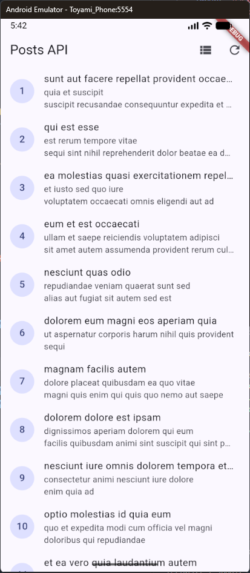
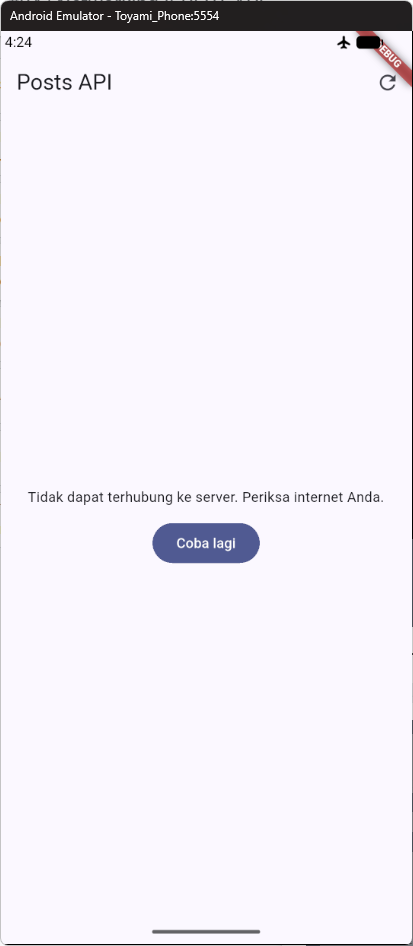
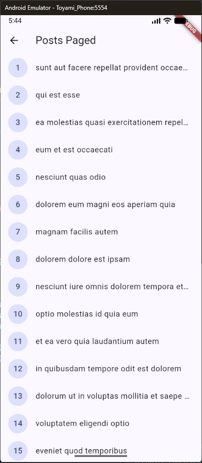
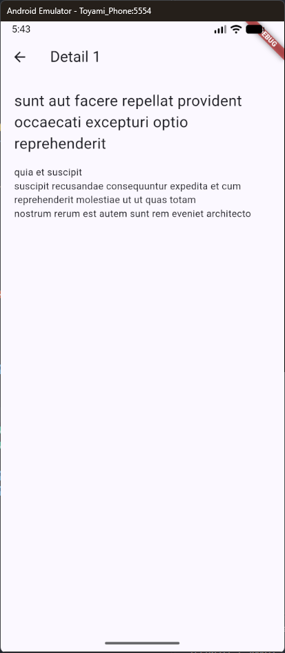
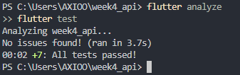

# Laporan Tugas Minggu 04 | Networking & REST API

- **Nama Mahasiswa**: Sultan Nashira Ariva
- **NIM**: 244107020187
- **Tautan Repositori**: [244107020187-mobile-course](https://github.com/sultanariva/244107020187-mobile-course)
- **Status**: ✅

---

## 1. Tujuan

Mempelajari komunikasi aplikasi Flutter dengan REST API menggunakan HTTP dan JSON, memetakan respons ke model Dart dengan aman, serta memisahkan akses data melalui repository. Praktikum ini juga menggunakan Dio dan Riverpod untuk menangani loading, error, empty, success, dan pagination.

## 2. Praktikum 1 — Dio dan Model Data

### 2.1. Model `Post`

Buat `lib/data/models/post.dart`. Parsing defensif menyediakan nilai default jika field tidak ada atau null.

```dart
class Post {
	const Post({
		required this.userId,
		required this.id,
		required this.title,
		required this.body,
	});

	final int userId;
	final int id;
	final String title;
	final String body;

	factory Post.fromJson(Map<String, dynamic> json) => Post(
				userId: (json['userId'] as num?)?.toInt() ?? 0,
				id: (json['id'] as num?)?.toInt() ?? 0,
				title: json['title'] as String? ?? '',
				body: json['body'] as String? ?? '',
			);

	Map<String, dynamic> toJson() => {
				'userId': userId,
				'id': id,
				'title': title,
				'body': body,
			};
}
```

### 2.2. Konfigurasi Dio

Buat `lib/data/api_client.dart`. Konfigurasi jaringan diletakkan di satu tempat agar semua request memakai base URL dan timeout yang konsisten.

```dart
import 'package:dio/dio.dart';

Dio createDio() {
	final dio = Dio(
		BaseOptions(
			baseUrl: 'https://jsonplaceholder.typicode.com',
			connectTimeout: const Duration(seconds: 10),
			receiveTimeout: const Duration(seconds: 10),
			headers: {'Accept': 'application/json'},
		),
	);

	dio.interceptors.add(
		LogInterceptor(requestBody: true, responseBody: false),
	);
	return dio;
}
```

### 2.3. Repository

Buat `lib/data/repositories/post_repository.dart`. Repository bertanggung jawab mengambil dan memetakan data, bukan menampilkan UI. Exception diteruskan ke provider agar UI dapat menampilkan state error.

```dart
import 'package:dio/dio.dart';
import '../models/post.dart';

class PostRepository {
  PostRepository(this._dio);
  final Dio _dio;

  Future<List<Post>> fetchPosts() async {
    final response = await _dio.get<List>('/posts');
    final data = response.data ?? [];
    return data
        .whereType<Map<String, dynamic>>()
        .map(Post.fromJson)
        .toList();
  }
}
```

## 3. Praktikum 2 — Riverpod dan Error Handling

### 3.1 Provider AsyncNotifier + pesan error ramah pengguna

Buat lib/data/providers.dart. Provider mengubah exception teknis menjadi pesan yang bisa ditampilkan ke pengguna:

```dart
import 'package:dio/dio.dart';
import 'package:flutter_riverpod/flutter_riverpod.dart';
import 'dart:async';
import 'api_client.dart';
import 'models/post.dart';
import 'repositories/post_repository.dart';

final dioProvider = Provider<Dio>((ref) => createDio());

final postRepositoryProvider = Provider<PostRepository>(
  (ref) => PostRepository(ref.watch(dioProvider)),
);

class PostListNotifier extends AsyncNotifier<List<Post>> {
  @override
  Future<List<Post>> build() async {
    // Exception dari repository otomatis menjadi AsyncError.
    // Inilah ekuivalen deklaratif dari AsyncValue.guard di versi lama.
    final repository = ref.watch(postRepositoryProvider);
    return repository.fetchPosts();
  }

  Future<void> refresh() async {
    state = const AsyncLoading();
    try {
      final repository = ref.read(postRepositoryProvider);
      state = AsyncData(await repository.fetchPosts());
    } catch (e, st) {
      state = AsyncError(e, st);
    }
  }
}

final postListProvider =
    AsyncNotifierProvider<PostListNotifier, List<Post>>(
        PostListNotifier.new,
        // Nonaktifkan retry otomatis Riverpod 3 agar error langsung
        // final dan mudah diuji (tanpa ini, future provider di-test
        // akan me-retry dan menggantung).
        retry: (retryCount, error) => null);

/// Helper khusus testing (letakkan di providers.dart): membaca state
/// pertama yang bukan loading lewat listener + completer, sehingga
/// test tidak menunggu retry dan tidak melakukan HTTP sungguhan.
Future<List<Post>> readPostsOnce(ProviderContainer container) {
  final completer = Completer<List<Post>>();
  final sub = container.listen<AsyncValue<List<Post>>>(
    postListProvider,
    (previous, next) {
      if (next.isLoading || completer.isCompleted) return;
      next.whenData(completer.complete);
      if (next.hasError) {
        completer.completeError(
          next.error ?? StateError('unknown error'),
          next.stackTrace ?? StackTrace.empty,
        );
      }
    },
    fireImmediately: true,
  );
  return completer.future.whenComplete(sub.close);
}

Future<Object?> readPostsErrorOnce(ProviderContainer container) {
  final completer = Completer<Object?>();
  final sub = container.listen<AsyncValue<List<Post>>>(
    postListProvider,
    (previous, next) {
      if (next.isLoading || completer.isCompleted) return;
      completer.complete(next.error);
    },
    fireImmediately: true,
  );
  return completer.future.whenComplete(sub.close);
}

String friendlyErrorMessage(Object error) {
  if (error is DioException) {
    switch (error.type) {
      case DioExceptionType.connectionTimeout:
      case DioExceptionType.sendTimeout:
      case DioExceptionType.receiveTimeout:
        return 'Koneksi lambat atau timeout. Periksa internet Anda lalu coba lagi.';
      case DioExceptionType.connectionError:
        return 'Tidak dapat terhubung ke server. Periksa internet Anda.';
      case DioExceptionType.badResponse:
        final code = error.response?.statusCode;
        if (code == 404) return 'Data tidak ditemukan (404).';
        if (code == 401 || code == 403) {
          return 'Akses ditolak ($code). Periksa kredensial Anda.';
        }
        return 'Server bermasalah ($code). Coba lagi nanti.';
      default:
        return 'Terjadi kesalahan jaringan. Coba lagi.';
    }
  }
  return 'Terjadi kesalahan tak terduga: $error';
}
```

### 3.2. UI: loading, error, empty, success

Buat lib/pages/post_list_page.dart. Setiap state mendapat tampilannya sendiri:

```bash
import 'package:flutter/material.dart';
import 'package:flutter_riverpod/flutter_riverpod.dart';
import '../data/providers.dart';

class PostListPage extends ConsumerWidget {
  const PostListPage({super.key});

  @override
  Widget build(BuildContext context, WidgetRef ref) {
    final postsAsync = ref.watch(postListProvider);

    return Scaffold(
      appBar: AppBar(
        title: const Text('Posts API'),
        actions: [
          IconButton(
            icon: const Icon(Icons.refresh),
            onPressed: () =>
                ref.read(postListProvider.notifier).refresh(),
          ),
        ],
      ),
      body: postsAsync.when(
        loading: () =>
            const Center(child: CircularProgressIndicator()),
        error: (err, _) => Center(
          child: Padding(
            padding: const EdgeInsets.all(24),
            child: Column(
              mainAxisSize: MainAxisSize.min,
              children: [
                Text(friendlyErrorMessage(err),
                    textAlign: TextAlign.center),
                const SizedBox(height: 12),
                FilledButton(
                  onPressed: () => ref.invalidate(postListProvider),
                  child: const Text('Coba lagi'),
                ),
              ],
            ),
          ),
        ),
        data: (posts) {
          if (posts.isEmpty) {
            return const Center(
                child: Text('Belum ada data dari server.'));
          }
          return RefreshIndicator(
            onRefresh: () =>
                ref.read(postListProvider.notifier).refresh(),
            child: ListView.builder(
              itemCount: posts.length,
              itemBuilder: (context, index) {
                final post = posts[index];
                return ListTile(
                  leading: CircleAvatar(
                      child: Text(post.id.toString())),
                  title: Text(post.title,
                      maxLines: 1,
                      overflow: TextOverflow.ellipsis),
                  subtitle: Text(post.body,
                      maxLines: 2,
                      overflow: TextOverflow.ellipsis),
                );
              },
            ),
          );
        },
      ),
    );
  }
}
```

### 3.3. Entry point dengan ProviderScope

Isi lib/main.dart:

```bash
import 'package:flutter/material.dart';
import 'package:flutter_riverpod/flutter_riverpod.dart';
import 'pages/post_list_page.dart';

void main() => runApp(const ProviderScope(child: MyApp()));

class MyApp extends StatelessWidget {
  const MyApp({super.key});
  @override
  Widget build(BuildContext context) => MaterialApp(
        title: 'Week 4 - REST API',
        theme: ThemeData(
            colorSchemeSeed: Colors.indigo, useMaterial3: true),
        home: const PostListPage(),
      );
}
```

UI membaca provider menggunakan `ref.watch` dan menampilkan empat kemungkinan state:

- **Loading**: tampilkan `CircularProgressIndicator`.
- **Error**: tampilkan pesan yang ramah dan tombol coba lagi.
- **Empty**: tampilkan informasi bahwa server belum mengirim data.
- **Success**: tampilkan daftar post dan sediakan refresh.

Pesan error sebaiknya memetakan `DioException` seperti timeout, koneksi terputus, HTTP 404, dan server 5xx menjadi informasi yang dapat dipahami pengguna. Hindari menampilkan pesan teknis mentah atau menelan exception dengan `catch` kosong.

Uji perilaku jaringan dengan koneksi normal, mode pesawat, dan base URL yang sengaja dibuat salah. Pulihkan konfigurasi setelah pengujian.


## 4. Praktikum 3 — Pagination Dasar

### 4.1. Repository paginated

Tambahkan method berikut ke PostRepository:

```bash
Future<List<Post>> fetchPostsPage({
  required int page,
  int limit = 10,
}) async {
  final response = await _dio.get<List>(
    '/posts',
    queryParameters: {'_page': page, '_limit': limit},
  );
  final data = response.data ?? [];
  return data
      .whereType<Map<String, dynamic>>()
      .map(Post.fromJson)
      .toList();
}
```

### 4.2. Notifier dengan state halaman

Lanjutkan lib/data/paged_posts.dart dengan notifier (guard ganda + data lama dipertahankan saat error):

```bash
import 'package:flutter_riverpod/flutter_riverpod.dart';
import 'models/post.dart';
import 'providers.dart';

class PagedPostsState {
  const PagedPostsState({
    this.items = const [],
    this.page = 0,
    this.isLoadingMore = false,
    this.hasMore = true,
    this.error,
  });

  final List<Post> items;
  final int page;
  final bool isLoadingMore;
  final bool hasMore;
  final Object? error;
}
```

### 4.3. Notifier dengan state halaman (lanjutan)

Lanjutkan file lib/data/paged_posts.dart dengan notifier:

```bash
class PagedPostsNotifier extends Notifier<PagedPostsState> {
  @override
  PagedPostsState build() {
    Future.microtask(loadFirstPage);
    return const PagedPostsState();
  }

  Future<void> loadFirstPage() async {
    final repository = ref.read(postRepositoryProvider);
    try {
      final items =
          await repository.fetchPostsPage(page: 1, limit: 10);
      state = PagedPostsState(
        items: items,
        page: 1,
        hasMore: items.length == 10,
      );
    } catch (e) {
      state = PagedPostsState(error: e);
    }
  }

  Future<void> loadNextPage() async {
    if (state.isLoadingMore || !state.hasMore) return;
    final repo = ref.read(postRepositoryProvider);
    final currentItems = state.items;
    final currentPage = state.page;
    state = PagedPostsState(
      items: currentItems,
      page: currentPage,
      isLoadingMore: true,
      hasMore: state.hasMore,
    );
    try {
      final next = currentPage + 1;
      final items =
          await repo.fetchPostsPage(page: next, limit: 10);
      state = PagedPostsState(
        items: [...currentItems, ...items],
        page: next,
        hasMore: items.length == 10,
      );
    } catch (e) {
      state = PagedPostsState(
        items: currentItems,
        page: currentPage,
        error: e,
      );
    }
  }
}

final pagedPostsProvider =
    NotifierProvider<PagedPostsNotifier, PagedPostsState>(
        PagedPostsNotifier.new);
```

### 4.4. UI infinite scroll

Buat lib/pages/paged_post_page.dart dengan ScrollController yang memicu halaman berikut 200px sebelum ujung list:

```bash
import 'package:flutter/material.dart';
import 'package:flutter_riverpod/flutter_riverpod.dart';
import '../data/paged_posts.dart';
import '../data/providers.dart';

class PagedPostPage extends ConsumerStatefulWidget {
  const PagedPostPage({super.key});

  @override
  ConsumerState<PagedPostPage> createState() =>
      _PagedPostPageState();
}

class _PagedPostPageState
    extends ConsumerState<PagedPostPage> {
  final _controller = ScrollController();

  @override
  void initState() {
    super.initState();
    _controller.addListener(() {
      if (_controller.position.pixels >=
          _controller.position.maxScrollExtent - 200) {
        ref.read(pagedPostsProvider.notifier).loadNextPage();
      }
    });
  }

  @override
  void dispose() {
    _controller.dispose();
    super.dispose();
  }

  @override
  Widget build(BuildContext context) {
    final state = ref.watch(pagedPostsProvider);
    if (state.error != null && state.items.isEmpty) {
      return Scaffold(
        appBar: AppBar(title: const Text('Posts Paged')),
        body: Center(
          child: Column(
            mainAxisSize: MainAxisSize.min,
            children: [
              Text(friendlyErrorMessage(state.error!)),
              const SizedBox(height: 12),
              FilledButton(
                onPressed: () => ref
                    .read(pagedPostsProvider.notifier)
                    .loadFirstPage(),
                child: const Text('Coba lagi'),
              ),
            ],
          ),
        ),
      );
    }
    return Scaffold(
      appBar: AppBar(title: const Text('Posts Paged')),
      body: ListView.builder(
        controller: _controller,
        itemCount: state.items.length + 1,
        itemBuilder: (context, index) {
          if (index == state.items.length) {
            if (!state.hasMore) {
              return const Padding(
                padding: EdgeInsets.all(16),
                child:
                    Center(child: Text('Semua data termuat.')),
              );
            }
            return const Padding(
              padding: EdgeInsets.all(16),
              child: Center(child: CircularProgressIndicator()),
            );
          }
          final post = state.items[index];
          return ListTile(
            leading: CircleAvatar(
                child: Text(post.id.toString())),
            title: Text(post.title,
                maxLines: 1, overflow: TextOverflow.ellipsis),
          );
        },
      ),
    );
  }
}
```

JSONPlaceholder mendukung parameter `_page` dan `_limit`. Muat halaman pertama terlebih dahulu, kemudian minta halaman berikut saat pengguna mendekati ujung daftar. Pertahankan data yang sudah tampil selama request berikutnya berjalan.

State pagination menyimpan daftar item, nomor halaman, status `isLoadingMore`, penanda `hasMore`, serta error bila ada. Sebelum request berikutnya, pastikan tidak sedang memuat dan masih ada data:

```dart
if (state.isLoadingMore || !state.hasMore) return;
```

Setelah request sukses, gabungkan data secara immutable:

```dart
items: [...currentItems, ...nextPageItems],
```

Gunakan `ScrollController` untuk memuat halaman selanjutnya sekitar 200 piksel sebelum ujung list. Tampilkan indikator kecil di bagian bawah, jangan menghapus item lama, dan hentikan request ketika halaman yang diterima berisi kurang dari batas item.

## 5. AI Challenge

AI boleh membantu merancang repository, tetapi hasilnya tetap harus diuji dan dipahami. Prompt dari codelab:

```text
Buatkan repository layer Flutter untuk endpoint GET /comments?postId={id}
dari JSONPlaceholder menggunakan Dio + flutter_riverpod.
Requirements:
- Model Comment dengan fromJson aman null (postId, id, name, email, body).
- CommentRepository dengan method fetchComments(postId) + timeout 10 detik.
- AsyncNotifierProvider dengan penanganan error otomatis (AsyncError) dan
	pesan error ramah pengguna untuk timeout, connection error, 404, dan 500.
- Satu unit test untuk fromJson dengan field yang hilang.
Jelaskan setiap bagian kode dalam komentar.
```

### 5.1. Prompt yang digunakan

Prompt utama yang dipakai untuk challenge AI dapat dilihat di [docs/ai_prompt.md](docs/ai_prompt.md).

Prompt yang dipakai secara ringkas:

```text
Buatkan repository layer Flutter untuk endpoint GET /comments?postId={id}
dari JSONPlaceholder menggunakan Dio + flutter_riverpod.
Requirements:
- Model Comment dengan fromJson aman null (postId, id, name, email, body).
- CommentRepository dengan method fetchComments(postId) + timeout 10 detik.
- AsyncNotifierProvider dengan penanganan error otomatis (AsyncError)
  dan fungsi pesan error ramah pengguna untuk timeout, connection error, 404, dan 500.
- Satu unit test untuk fromJson dengan field yang hilang.
Jelaskan setiap bagian kode dalam komentar.
```

### 5.2. Output AI awal

Baseline output AI yang dihasilkan awalnya berpotensi mengandung kekurangan seperti cast langsung pada `fromJson`, timeout yang tersebar di method, dan duplikasi fungsi error mapper. Detailnya ada di [docs/ai_baseline_output.md](docs/ai_baseline_output.md).

Catatan penting:
- output awal AI terlihat masuk akal secara struktur,
- tetapi masih ada masalah pada parsing aman, konfigurasi timeout yang belum terpusat, dan duplikasi fungsi error mapping,
- sehingga hasil tersebut tidak langsung diterima tanpa review.

### 5.3. Perbaikan manual yang dilakukan

Perbaikan manual dan alasan teknis terdokumentasi di [docs/manual_fixes.md](docs/manual_fixes.md).

Perbaikan utama meliputi:
- mengganti cast langsung menjadi nilai default untuk field null/hilang,
- menjaga `baseUrl` dan timeout di satu client Dio,
- menghindari duplikasi `friendlyErrorMessage`,
- menambahkan edge case test untuk field null/hilang,
- memastikan UI tidak memanggil Dio langsung.

### 5.4. Temuan verifikasi

Sebelum menerima hasil AI, verifikasi:

- UI tidak memanggil Dio langsung; akses data melewati repository dan provider.
- Parsing `fromJson` tetap aman jika field hilang atau null.
- Timeout, connection error, 404, dan 500 memiliki pesan yang sesuai.
- Base URL dan timeout dikonfigurasi terpusat.
- Test menguji field hilang dan sedikitnya satu edge case tambahan.
- Prompt, hasil awal AI, perubahan manual, serta alasan keputusan teknis dicatat di `docs/`.

Hasil verifikasi yang sudah dilakukan:
- UI tidak memanggil Dio langsung. Akses data dilakukan lewat repository dan provider.
- `fromJson` aman terhadap field yang hilang atau null; tidak lagi memakai cast langsung yang bisa crash.
- `DioExceptionType` untuk timeout, connectionError, dan badResponse dipetakan ke pesan yang ramah user melalui [lib/data/network_errors.dart](lib/data/network_errors.dart).
- `baseUrl` dan timeout terpusat di `createDio()` di [lib/data/api_client.dart](lib/data/api_client.dart).
- Test edge case ditambahkan untuk field hilang/null, bukan hanya happy path.
- Validasi lint dan test dijalankan dan semuanya lulus.

### 5.5. Hasil testing

Hasil `flutter analyze` dan `flutter test` dapat dilihat di [docs/testing_results.md](docs/testing_results.md).

### 5.6. Struktur dokumentasi AI challenge

- [docs/ai_prompt.md](docs/ai_prompt.md)
- [docs/ai_baseline_output.md](docs/ai_baseline_output.md)
- [docs/manual_fixes.md](docs/manual_fixes.md)
- [docs/testing_results.md](docs/testing_results.md)

Semua catatan prompt, output awal, perbaikan, dan hasil validasi tersimpan di folder [docs](docs).

## 6. Refactoring dan Testing

Tantangan refactoring dari codelab:

- Ekstrak tampilan satu baris daftar menjadi widget `PostTile`.
- Pindahkan fungsi pesan error ke `lib/data/network_errors.dart` agar bisa dipakai ulang.
- Tambahkan detail post dengan GoRouter pada route `/post/:id`.
- Uji model, pemetaan error, dan provider dengan repository palsu tanpa request internet.

### Testing: unit test model + mock repository

Buat test/post_test.dart, uji parsing aman null, mapping error, dan provider dengan repository palsu (tanpa internet):

```dart
import 'package:flutter_test/flutter_test.dart';
import 'package:dio/dio.dart';
import 'package:flutter_riverpod/flutter_riverpod.dart';
import 'package:week4_api/data/models/post.dart';
import 'package:week4_api/data/providers.dart';
import 'package:week4_api/data/repositories/post_repository.dart';

class FakePostRepository extends PostRepository {
  FakePostRepository({this.items, this.throwError = false})
      : super(Dio());
  final List<Post>? items;
  final bool throwError;

  @override
  Future<List<Post>> fetchPosts() async {
    if (throwError) {
      throw DioException(
        requestOptions: RequestOptions(path: '/posts'),
        type: DioExceptionType.connectionError,
      );
    }
    return items ?? const [];
  }

  @override
  Future<List<Post>> fetchPostsPage(
      {required int page, int limit = 10}) async {
    return fetchPosts();
  }
}

void main() {
  test('fromJson aman terhadap field yang hilang', () {
    final post = Post.fromJson({'id': 7});
    expect(post.id, 7);
    expect(post.title, '');
    expect(post.userId, 0);
  });

  test('friendlyErrorMessage untuk connection error', () {
    final err = DioException(
      requestOptions: RequestOptions(path: '/posts'),
      type: DioExceptionType.connectionError,
    );
    expect(friendlyErrorMessage(err), contains('terhubung'));
  });

  test('provider sukses dengan repository palsu', () async {
    final container = ProviderContainer(
      overrides: [
        postRepositoryProvider.overrideWithValue(
          FakePostRepository(items: [
            const Post(
                userId: 1, id: 1, title: 'Tes', body: 'Isi'),
          ]),
        ),
      ],
    );
    addTearDown(container.dispose);
    // Gunakan helper readPostsOnce (lihat providers.dart).
    final posts = await readPostsOnce(container);
    expect(posts.length, 1);
    expect(posts.first.title, 'Tes');
  });

  test('provider error dengan repository palsu', () async {
    final container = ProviderContainer(
      overrides: [
        postRepositoryProvider.overrideWithValue(
          FakePostRepository(throwError: true),
        ),
      ],
    );
    addTearDown(container.dispose);
    // Gunakan helper readPostsErrorOnce (lihat providers.dart).
    final err = await readPostsErrorOnce(container);
    expect(err, isA<DioException>());
    expect(friendlyErrorMessage(err!), contains('terhubung'));
  });
}
```

Jalankan pemeriksaan dengan:

```bash
flutter analyze
flutter test
```

### Checklist Verifikasi

- ✅ UI tidak memanggil Dio secara langsung.
- ✅ Parsing model aman terhadap field hilang atau null.
- ✅ Loading, error/retry, empty, dan success tampil sesuai kondisi.
- ✅ Pagination menambah data, tidak mengirim request ganda, dan berhenti ketika data habis.
- ✅ Test tidak membuat request HTTP sungguhan.
- ✅ `flutter analyze` tidak melaporkan issue dan `flutter test` lulus.
- ✅ Prompt, hasil AI, perbaikan, alasan keputusan, dan screenshot hasil aplikasi telah didokumentasikan.

### Bukti Screenshot Aplikasi

**Daftar post**



**State error**



**Pagination**



**Detail post**



**Hasil Test**



## 7. Tugas, Refleksi, dan Referensi

### 7.1. Tugas Mini Project

Bangun aplikasi daftar data dari REST API yang memenuhi kriteria berikut:

- Ambil data dari JSONPlaceholder `/posts` atau API publik lain tanpa API key.
- Gunakan Dio terpusat, model dengan parsing aman, repository, dan Riverpod.
- Tangani loading, error dengan retry, empty, dan success.
- Tambahkan infinite scroll dengan 10 item per halaman dan guard request ganda.
- Sertakan minimal dua test: unit test model atau error mapping, serta provider test dengan repository palsu.
- Dokumentasikan AI Challenge dan hasil verifikasi di `docs/`.
- Simpan project portfolio di `04-week-4-networking-rest-api/` dengan `lib/`, `test/`, `docs/`, `screenshots/`, dan README.

### 7.3. Refleksi

**Mengapa UI tidak sebaiknya memanggil Dio langsung?**

Pemisahan repository membuat widget berfokus pada tampilan, sedangkan detail komunikasi jaringan berada pada lapisan data. Jika UI memanggil Dio langsung, logika request, parsing, dan error handling tersebar di banyak widget sehingga lebih sulit diuji, digunakan ulang, dan diubah.

**Kapan pagination server lebih tepat daripada mengambil semua data sekaligus?**

Pagination server cocok ketika jumlah data besar atau terus bertambah karena aplikasi hanya mengunduh bagian yang dibutuhkan. Mengambil semua data sekaligus masih masuk akal untuk dataset kecil dan terbatas, tetapi kurang efisien ketika ukuran respons tumbuh.

**Bagaimana error repository dapat menjadi `AsyncError`?**

Ketika pemanggilan asynchronous pada `build()` melempar exception, Riverpod menyimpan exception tersebut di state `AsyncError`, sehingga UI dapat menanganinya melalui `AsyncValue.when()`. `try/catch` eksplisit tetap diperlukan saat notifier melakukan operasi tambahan seperti refresh atau saat aplikasi perlu mempertahankan data lama dan mengatur state sendiri.

**Apa yang perlu dievaluasi dari hasil AI?**

Pastikan kode mengikuti pemisahan UI-repository, parsing aman, pemetaan error lengkap, dan test mencakup edge case. Catat bagian yang diubah beserta alasan teknisnya; kode yang dihasilkan AI tidak dianggap benar sebelum diverifikasi.

## 8. Kesimpulan

Integrasi REST API yang terstruktur memerlukan pemisahan tanggung jawab antara client jaringan, model, repository, provider, dan UI. Dio memusatkan konfigurasi request, Riverpod mengelola state asynchronous, dan pagination menjaga pemuatan data tetap efisien. Pengujian dengan repository palsu membantu memverifikasi perilaku aplikasi tanpa bergantung pada koneksi internet.

